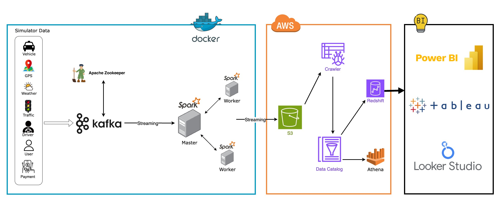

# Taipei Taxi Simulator Data

# Project Introduction
This project is an experimental implementation of Kafka and Spark, designed to gain hands-on experience while understanding how these two technologies work. It also integrates AWS for data storage and provides data for BI tools to create visual dashboards.
